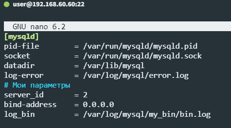

# Домашнее задание к занятию 12.6. «Репликация и масштабирование. Часть 1»

### Инструкция по выполнению домашнего задания

1. Сделайте fork [репозитория c шаблоном решения](https://github.com/netology-code/sys-pattern-homework) к себе в Github и переименуйте его по названию или номеру занятия, например, https://github.com/имя-вашего-репозитория/gitlab-hw или https://github.com/имя-вашего-репозитория/8-03-hw).
2. Выполните клонирование этого репозитория к себе на ПК с помощью команды `git clone`.
3. Выполните домашнее задание и заполните у себя локально этот файл README.md:
   - впишите вверху название занятия и ваши фамилию и имя;
   - в каждом задании добавьте решение в требуемом виде: текст/код/скриншоты/ссылка;
   - для корректного добавления скриншотов воспользуйтесь инструкцией [«Как вставить скриншот в шаблон с решением»](https://github.com/netology-code/sys-pattern-homework/blob/main/screen-instruction.md);
   - при оформлении используйте возможности языка разметки md. Коротко об этом можно посмотреть в [инструкции по MarkDown](https://github.com/netology-code/sys-pattern-homework/blob/main/md-instruction.md).
4. После завершения работы над домашним заданием сделайте коммит (`git commit -m "comment"`) и отправьте его на Github (`git push origin`).
5. Для проверки домашнего задания преподавателем в личном кабинете прикрепите и отправьте ссылку на решение в виде md-файла в вашем Github.
6. Любые вопросы задавайте в чате учебной группы и/или в разделе «Вопросы по заданию» в личном кабинете.

Желаем успехов в выполнении домашнего задания.

---

### Задание 1

На лекции рассматривались режимы репликации master-slave, master-master, опишите их различия.

*Ответить в свободной форме.*

#### Ответ

Начну с плохого, `master-master` - это когда есть 2+ сервера БД и они оба "мастеры", т.е. в них одновременно можно и читать и писать (в любой из них). Наверное хорошо (хотя я бы так не сказал), что можно так писать везде и читать одновременно, но получаем проблемы с синхронизацией данных, особенно в случае потери связи с одной (или несколькими) из БД. 

`master-slave` - в этом случае данные пишем только в мастер, а читаем только из слэйвов, т.о. обеспечивается целостность данных (т.к. мастер один и один источник изменения данных) и увеличивается производительность (т.к. слэйв серверов может быть несколько и с каждого можно читать). Единственный минус - небольшая задержка на репликацию в слэйв серверах после изменения данных в мастере. 

И я пока не понял, что будет если есть группы серверов `master-slave`, например 2 сервера в одной сети и 2 в другой, один из них мастер. Если сеть **между** группами серверов упадёт на какое-то время - что будет с данными и как оно будет работать? Т.е. именно между группами, при этом доступ к обоим группам из других сервисов останется, т.е. сервисы смогут и читать и писать, но группы серверов БД друг друга не видят. Получится, что в одной группе так и останется по серверу master и slave, а в другой оба `slave-slave` и один из них по идее должен стать мастером. Если потом появится связь между группами, и получится у нас 2 группы серверов `master-slave`-`master-slave` - что произойдёт и как оно дальше будет работать? Как вообще такого избежать? :)

---

### Задание 2

Выполните конфигурацию master-slave репликации, примером можно пользоваться из лекции.

*Приложите скриншоты конфигурации, выполнения работы: состояния и режимы работы серверов.*

---

#### Ответ

Мастер:

Слэйв:

## Дополнительные задания (со звёздочкой*)
Эти задания дополнительные, то есть не обязательные к выполнению, и никак не повлияют на получение вами зачёта по этому домашнему заданию. Вы можете их выполнить, если хотите глубже шире разобраться в материале.

---

### Задание 3* 

Выполните конфигурацию master-master репликации. Произведите проверку.

*Приложите скриншоты конфигурации, выполнения работы: состояния и режимы работы серверов.*
