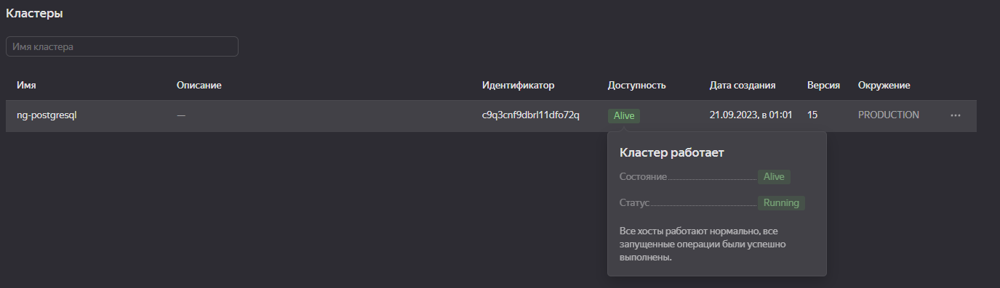

# Домашнее задание к занятию 12.09. «Базы данных в облаке»

**Домашнее задание выполните в Google Docs или в md-файле в вашем репозитории GitHub.** 

Для оформления вашего решения в GitHub можете воспользоваться [шаблоном](https://github.com/netology-code/sys-pattern-homework).

Название файла Google Docs должно содержать номер лекции и фамилию студента. Пример названия: «12.9. Базы данных в облаке — Александр Александров».

Перед тем как выслать ссылку, убедитесь, что её содержимое не является приватным, то есть открыто на просмотр всем, у кого есть ссылка. Если необходимо прикрепить дополнительные ссылки, просто добавьте их в свой Google Docs.

Любые вопросы по решению задач задавайте в чате учебной группы.


---

Домашнее задание подразумевает, что вы уже делали предыдущие работы в Яндекс.Облаке, и у вас есть аккаунт и каталог.


Используйте следующие рекомендации во избежание лишних трат в Яндекс.Облаке:
1) Сразу после выполнения задания удалите кластер.
2) Если вы решили взять паузу на выполнение задания, то остановите кластер.

### Задание 1


#### Создание кластера
1. Перейдите на главную страницу сервиса Managed Service for PostgreSQL.
1. Создайте кластер PostgreSQL со следующими параметрами:
- класс хоста: s2.micro, диск network-ssd любого размера;
- хосты: нужно создать два хоста в двух разных зонах доступности и указать необходимость публичного доступа, то есть публичного IP адреса, для них;
- установите учётную запись для пользователя и базы.

Остальные параметры оставьте по умолчанию либо измените по своему усмотрению.

* Нажмите кнопку «Создать кластер» и дождитесь окончания процесса создания, статус кластера = RUNNING. Кластер создаётся от 5 до 10 минут.

---

### Ответ

Скриншоты создания кластера по вышеуказанным параметрам:




---

#### Подключение к мастеру и реплике 

* Используйте инструкцию по подключению к кластеру, доступную на вкладке «Обзор»: cкачайте SSL-сертификат и подключитесь к кластеру с помощью утилиты psql, указав hostname всех узлов и атрибут ```target_session_attrs=read-write```.

* Проверьте, что подключение прошло к master-узлу.
```
select case when pg_is_in_recovery() then 'REPLICA' else 'MASTER' end;
```
* Посмотрите количество подключенных реплик:
```
select count(*) from pg_stat_replication;
```

---

### Ответ

Подключался к кластеру через виртуалку:


---

### Проверьте работоспособность репликации в кластере

* Создайте таблицу и вставьте одну-две строки.
```
CREATE TABLE test_table(text varchar);
```
```
insert into test_table values('Строка 1'),('Строка 2');
```

* Выйдите из psql командой ```\q```.

* Теперь подключитесь к узлу-реплике. Для этого из команды подключения удалите атрибут ```target_session_attrs```  и в параметре атрибут ```host``` передайте только имя хоста-реплики. Роли хостов можно посмотреть на соответствующей вкладке UI консоли.

* Проверьте, что подключение прошло к узлу-реплике.
```
select case when pg_is_in_recovery() then 'REPLICA' else 'MASTER' end;
```
* Проверьте состояние репликации
```
select status from pg_stat_wal_receiver;
```

---

### Ответ

Т.к. я тупо делаю что написнао, особо не вникая в суть (хотя в целом понимаю), но не понятно что должно быть в статусе и почему пустой ответ:


---

* Для проверки, что механизм репликации данных работает между зонами доступности облака, выполните запрос к таблице, созданной на предыдущем шаге:
```
select * from test_table;
```

*В качестве результата вашей работы пришлите скриншоты:*

*1) Созданной базы данных;*
*2) Результата вывода команды на реплике ```select * from test_table;```.*


---

### Ответ

Результат вывода таблицы в реплике, которая (таблица) была создана в мастере и там же наполнена данными:


---


### Задание 2*

Создайте кластер, как в задании 1 с помощью Terraform.


*В качестве результата вашей работы пришлите скришоты:*

*1) Скриншот созданной базы данных.*
*2) Код Terraform, создающий базу данных.*

---

Задания, помеченные звёздочкой, — дополнительные, то есть не обязательные к выполнению, и никак не повлияют на получение вами зачёта по этому домашнему заданию. Вы можете их выполнить, если хотите глубже шире разобраться в материале.
