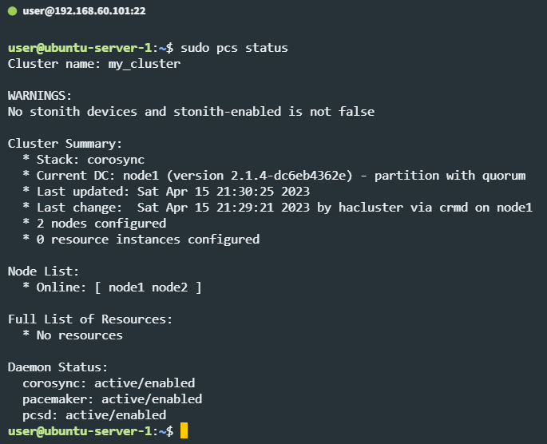
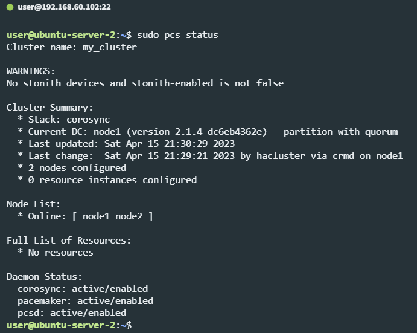

# Домашнее задание к занятию 10.3 «Pacemaker»

Домашнее задание выполните в Google Docs и отправьте в личном кабинете на проверку ссылку на ваш документ.

Название файла должно содержать номер лекции и фамилию студента. Пример названия: «10.3 Pacemaker — Александр Александров»

Перед тем как выслать ссылку, убедитесь, что её содержимое не приватно, т. е.  открыто на просмотр всем, у кого есть ссылка. Если нужно прикрепить дополнительные ссылки, просто добавьте их в Google Docs.

Любые вопросы по решению задач задавайте в чате учебной группы.

---

### Задание 1

Опишите основные функции и назначение Pacemaker.

*Приведите ответ в свободной форме.*

#### Ответ:

Исходя из информации в лекции и презентации, не очень понимаю для чего он нужен.

Вроде бы контролирует и восстанавливает (при возможности) работу ПО на сервере, отключает сервер от кластера при обнаружении ошибок, синхронизирует конфиги между кластерами и т.п. Но вот не понятно, сервера должны быть с одинаковыми характеристиками и конфигурацией или нет, ПО на них установлено и настроено уже должно быть одинаковое или нет, настроит ли он сам новый сервер (установит ПО/настройки и т.п. (реплицирует из других серверов)) при подключении к кластеру или всё надо настроить самому до подключения... 

---

### Задание 2

Опишите основные функции и назначение Corosync.

*Приведите ответ в свободной форме.*

#### Ответ:

Опять же, в лекции всего пара слов было сказано о corosync'е, и как понимаю - это нечто типо мониторинга серверов, система которая знает какой сервер работает, какой нет, на каком из серверов работает ПО а на каком нет, и обменивается этой информацией между остальными серверами в кластере. Предположу, что pacemaker использует эту информацию, чтобы принимать какие-то решения по восстановлению работы или отключению сервера от кластера.

---

### Задание 3

Соберите модель, состоящую из двух виртуальных машин. Установите Pacemaker, Corosync, Pcs. Настройте HA кластер.

*Пришлите скриншот рабочей конфигурации и состояния сервиса для каждого нода.*

#### Ответ:





---

### Задания со звёздочкой*
Эти задания дополнительные. Выполнять их не обязательно. Это не повлияет на зачёт. Вы можете их выполнить, если хотите глубже разобраться в материале.
 
---

### Задание 4

Установите и настройте DRBD-сервис для настроенного кластера.

*Пришлите скриншот рабочей конфигурации и состояние сервиса для каждого нода.*


