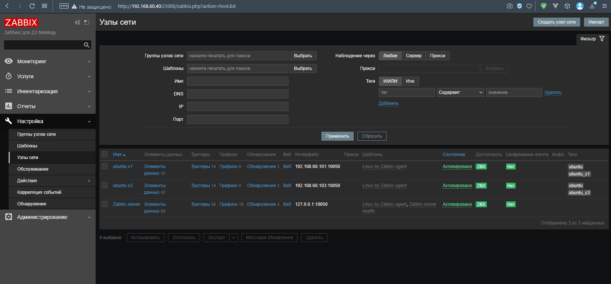

# Домашнее задание к занятию 9.2 «Zabbix. Часть 1»


### Инструкция по выполнению домашнего задания

1. Сделайте fork [репозитория c шаблоном решения](https://github.com/netology-code/sys-pattern-homework) к себе в Github и переименуйте его по названию или номеру занятия, например, https://github.com/имя-вашего-репозитория/gitlab-hw или https://github.com/имя-вашего-репозитория/8-03-hw).
2. Выполните клонирование этого репозитория к себе на ПК с помощью команды `git clone`.
3. Выполните домашнее задание и заполните у себя локально этот файл README.md:
   - впишите вверху название занятия и ваши фамилию и имя;
   - в каждом задании добавьте решение в требуемом виде: текст/код/скриншоты/ссылка;
   - для корректного добавления скриншотов воспользуйтесь инструкцией [«Как вставить скриншот в шаблон с решением»](https://github.com/netology-code/sys-pattern-homework/blob/main/screen-instruction.md);
   - при оформлении используйте возможности языка разметки md. Коротко об этом можно посмотреть в [инструкции по MarkDown](https://github.com/netology-code/sys-pattern-homework/blob/main/md-instruction.md).
4. После завершения работы над домашним заданием сделайте коммит (`git commit -m "comment"`) и отправьте его на Github (`git push origin`).
5. Для проверки домашнего задания преподавателем в личном кабинете прикрепите и отправьте ссылку на решение в виде md-файла в вашем Github.
6. Любые вопросы задавайте в чате учебной группы и/или в разделе «Вопросы по заданию» в личном кабинете.

Желаем успехов в выполнении домашнего задания.

 ---

### Задание 1 

Установите Zabbix Server с веб-интерфейсом.

*Приложите скриншот авторизации в админке.*
*Приложите текст использованных команд в GitHub.*

#### Ответ:

Установку заббикса производил через энсибл. Конфиг файл [здесь](src/resources/09.02/zabbix-host.yaml).

Единственный момент, я так и не смог восстановить дамп через энсибл с плагином community.postgresql, т.к. при восстановлении
дампа владелец таблиц был postgres, а не zabbix. Чтобы я не делал, либо падает на восстановлении, либо пользователь
postgres. Пробовал указывать логин и пароль, добавлять опцию "-O zabbix" - не работает. В итоге просто удалил БД
и загрузил дамп командой: 
```shell
zcat /usr/share/zabbix-sql-scripts/postgresql/server.sql.gz | sudo -u zabbix psql zabbix 
```



*П.С. Почему-то сервер заббикса был не запущен, но после рестарта ВМ всё запустилось (забыл сделать скриншот).*

---

### Задание 2 

Установите Zabbix Agent на два хоста.

*Приложите скриншот раздела Configuration > Hosts, где видно, что агенты подключены к серверу.*
*Приложите скриншот лога zabbix agent, где видно, что он работает с сервером.*
*Приложите скриншот раздела Monitoring > Latest data для обоих хостов, где видны поступающие от агентов данные.*
*Приложите текст использованных команд в GitHub.*

#### Ответ:











Установку агентов производил через энсибл. Конфиг файл [здесь](src/resources/09.02/zabbix-agent.yaml).




---
## Задание со звёздочкой*

Это дополнительное задание. Его выполнять не обязательно. На зачёт это не повлияет. Вы можете его выполнить, если хотите глубже разобраться в материале.

### Задание 3* 

Установите Zabbix Agent на Windows (компьютер) и подключите его к серверу Zabbix.

*Приложите скриншот раздела Latest Data, где видно свободное место на диске C:*


