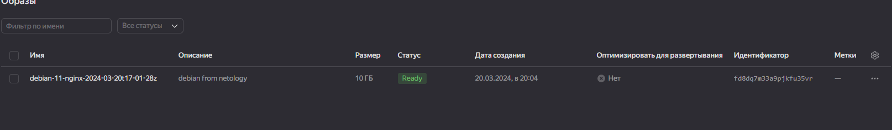
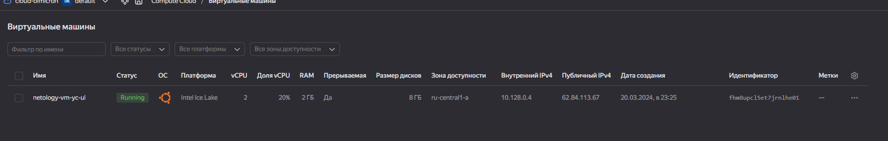
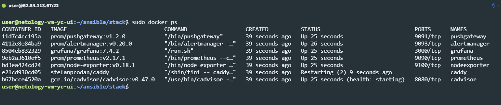
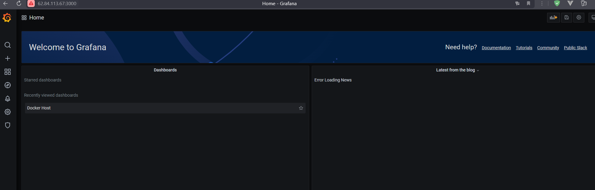
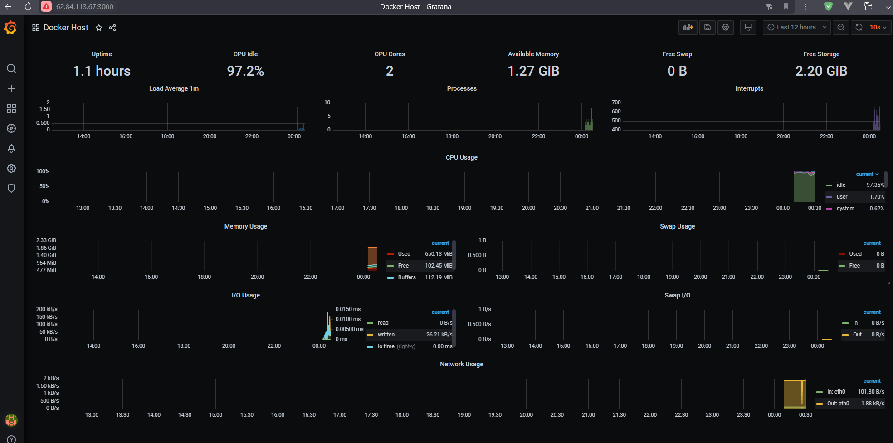

# Домашнее задание к занятию 4. «Оркестрация группой Docker-контейнеров на примере Docker Compose»

## Как сдавать задания

Обязательны к выполнению задачи без звёздочки. Их нужно выполнить, чтобы получить зачёт и диплом о профессиональной переподготовке.

Задачи со звёздочкой (*) — это дополнительные задачи и/или задачи повышенной сложности. Их выполнять не обязательно, но они помогут вам глубже понять тему.

Домашнее задание выполните в файле readme.md в GitHub-репозитории. В личном кабинете отправьте на проверку ссылку на .md-файл в вашем репозитории.

Любые вопросы по решению задач задавайте в чате учебной группы.

---


## Важно


Перед отправкой работы на проверку удаляйте неиспользуемые ресурсы.
Это нужно, чтобы не расходовать средства, полученные в результате использования промокода.

Подробные рекомендации [здесь](https://github.com/netology-code/virt-homeworks/blob/virt-11/r/README.md).

---

## Задача 1


Создайте собственный образ любой операционной системы (например, debian-11) с помощью Packer версии 1.7.0 . Перед выполнением задания изучите ([инструкцию!!!](https://cloud.yandex.ru/docs/tutorials/infrastructure-management/packer-quickstart)). В инструкции указана минимальная версия 1.5, но нужно использовать 1.7, так как там есть нужный нам функционал


Чтобы получить зачёт, вам нужно предоставить скриншот страницы с созданным образом из личного кабинета YandexCloud.

#### Ответ:

Создал файл [config.pkr.hcl](res/config.pkr.hcl) и инициализировал пакер:
```shell
> packer init .\config.pkr.hcl
Installed plugin github.com/hashicorp/yandex v1.1.3 in "*/packer.d/plugins/github.com/hashicorp/yandex/packer-plugin-yandex_v1.1.3_x5.0_windows_amd64.exe"
```

Запустил сборку образа:
```shell
> packer build .\debian-11.json

==> Builds finished. The artifacts of successful builds are:
--> yandex: A disk image was created: debian-11-nginx-2024-03-20t17-01-28z (id: fd8dq7m33a9pjkfu35vr) with family name debian-web-server

```



## Задача 2

**2.1.** Создайте вашу первую виртуальную машину в YandexCloud с помощью web-интерфейса YandexCloud.        

**2.2.*** **(Необязательное задание)**      
Создайте вашу первую виртуальную машину в YandexCloud с помощью Terraform (вместо использования веб-интерфейса YandexCloud).
Используйте Terraform-код в директории ([src/terraform](https://github.com/netology-group/virt-homeworks/tree/virt-11/05-virt-04-docker-compose/src/terraform)).

Чтобы получить зачёт, вам нужно предоставить вывод команды terraform apply и страницы свойств, созданной ВМ из личного кабинета YandexCloud.

#### Ответ:

Т.к. 2.2 не обязательно, сделал только 2.1:



## Задача 3

С помощью Ansible и Docker Compose разверните на виртуальной машине из предыдущего задания систему мониторинга на основе Prometheus/Grafana.
Используйте Ansible-код в директории ([src/ansible](https://github.com/netology-group/virt-homeworks/tree/virt-11/05-virt-04-docker-compose/src/ansible)).

Чтобы получить зачёт, вам нужно предоставить вывод команды "docker ps" , все контейнеры, описанные в [docker-compose](https://github.com/netology-group/virt-homeworks/blob/virt-11/05-virt-04-docker-compose/src/ansible/stack/docker-compose.yaml),  должны быть в статусе "Up".

#### Ответ:



Пришлось долго повозиться с caddy, чтобы запустить его, т.к. он почему-то не запускался, в итоге запустил (удалил контейнер caddy и запустил его сам в ручную по документации), но забыл сделать скриншот команды `docker ps`. :( 

## Задача 4

1. Откройте веб-браузер, зайдите на страницу http://<внешний_ip_адрес_вашей_ВМ>:3000.
2. Используйте для авторизации логин и пароль из [.env-file](https://github.com/netology-group/virt-homeworks/blob/virt-11/05-virt-04-docker-compose/src/ansible/stack/.env).
3. Изучите доступный интерфейс, найдите в интерфейсе автоматически созданные docker-compose-панели с графиками([dashboards](https://grafana.com/docs/grafana/latest/dashboards/use-dashboards/)).
4. Подождите 5-10 минут, чтобы система мониторинга успела накопить данные.

Чтобы получить зачёт, предоставьте: 

- скриншот работающего веб-интерфейса Grafana с текущими метриками, как на примере ниже.
<p align="center">
  
</p>


#### Ответ:





## Задача 5 (*)

Создайте вторую ВМ и подключите её к мониторингу, развёрнутому на первом сервере.

Чтобы получить зачёт, предоставьте:

- скриншот из Grafana, на котором будут отображаться метрики добавленного вами сервера.


